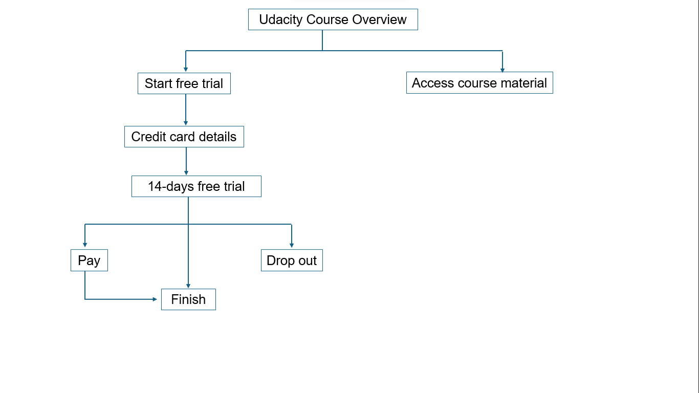
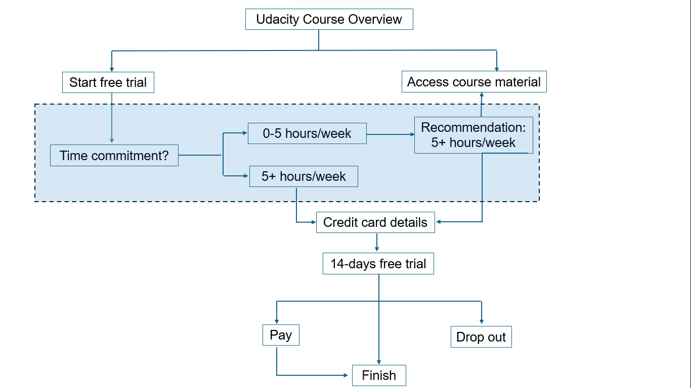

# AB-test

## Overview

Udacity's course overview page offers two options: "start free trial" and "access course materials." If a student clicks "start free trial," they must enter credit card details and will be enrolled in the paid course's free trial, which lasts for 14 days before charging them unless they cancel. If the student clicks "access course materials," they can view videos and take quizzes for free, but they won't receive coaching, a verified certificate, or feedback on their final project.

In this experiment, Udacity tested a new approach where, upon clicking "start free trial," students are asked how much time they can commit weekly. If they indicate 5 or more hours, they proceed to the usual checkout process. If they indicate less than 5 hours, a message suggests that the course typically requires more time and offers the option to access course materials for free instead of continuing with the free triial. The student can then choose to proceed with the free trial or access the materials for free. See the figures below highlighting the flow of the control and experiment websites.

The hypothesis was that setting clearer expectations upfront would reduce the number of students who leave the trial due to lack of time, without significantly lowering the number of students who complete the course. This could improve the student experience and help coaches focus on students more likely to succeed.

The experiment is tracked by cookies, and users who enroll in the free trial are tracked by their user ID from that point onward. A user can only enroll in the free trial once, and users who don’t enroll are not tracked. 

In the sections below, we briefly discuss the analysis and conclusions from the project.

## Metric choice

The following metrics, their baseline values (see data folder) and minimum detectable values were provided:

* Number of cookies: Number of unique cookies to view the course overview page. (dmin=3000)
* Number of user-ids:Number of users who enroll in the free trial. (dmin=50)
* Number of clicks: Number of unique cookies to click the "Start free trial" button (which happens before the free trial screener is trigger). (dmin=240)
* Click-through-probability: Number of unique cookies to click the "Start free trial" button divided by number of unique cookies to view the course overview page. (dmin=0.01)
* Gross conversion: Number of user-ids to complete checkout and enroll in the free trial divided by number of unique cookies to click the "Start free trial" button. (dmin= 0.01)
* Retention: Number of user-ids to remain enrolled past the 14-day boundary (and thus make at least one payment) divided by number of user-ids to complete checkout. (dmin=0.01)
* Net conversion: Number of user-ids to remain enrolled past the 14-day boundary (and thus make at least one payment) divided by the number of unique cookies to click the "Start free trial" button. (dmin= 0.0075)

We selected the number of cookies, clicks and click through probability as the invariant metrics because they depend on events before the click event.

## Analysis

We then calculate the variability (standard error) for the evaluation metrics followed by the 95% confidence intervals. For the analytical variabilities, a sample size of 5000 cookies was used. We then calculated the minimum size of the experiment (number of cookies) for each metric using their standard deviation, minimum detectable effect, significance level (0.95) and power (0.80). Gross conversion and net conversion require about 650,000 cookies which is equivalent to 16 days of experiment. On the other hand, retention reuired 4.7 million cookies leading to 118 days of experiment. We recommended an increase in the minimum detectable effect for retention so that the duration of the experiment does not exceed 30 days. A cutoff of 30 days was chosen because it exceeds the 14-day free trial duration and is long enough for the wearing off of the novelty effect.

We then looked at the data from the AB test. It contained the following columns for the treatment and control groups:

* Pageviews: Number of unique cookies to view the course overview page that day.
* Clicks: Number of unique cookies to click the course overview page that day.
* Enrollments: Number of user-ids to enroll in the free trial that day.
* Payments: Number of user-ids who who enrolled on that day to remain enrolled for 14 days and thus make a payment.

The data had missing information which we removed from our analysis. We then verified that the invariant metrics were equivalent between the experiment and the control groups. We then analysed the evaluation metrics by calculating the difference between the metrics in the two groups and evaluating if the differences were both practically and statistically significant. Additionally, we did sign tests to confirm our observations.

## Results

We obtained the following results from our study:
* The number of enrollments and the gross conversion rate in the control group were higher than in the experiment. This suggests that users in the control group who did not see the recommendation enrolled in the course in higher numbers but must have dropped out due to time commitments. Conversely in the experiment group, users with time commitment issues dropped out after the recommendations and therefore the number of enrollments dropped. This satisfies one of the objectives of the AB test which was reducing the number of frustrated students who drop out before finishing and therefore enhancing user experience.
* The retention rate is higher for experiment than control. Even though the difference is not practically significant, it is statistically significant. This suggests that more users who enroll are willing to pay in the experiment group than in the control group.
* The net conversion rate is the same for both groups. The difference is both statistically and practically insignificant. This means that even though the test enhanced user experience, it did not result in increased revenue for the website. 

## Recommendations

* In the end, we recommended the team to launch this change because it enhances user experience without reducing the revenue generated.
* We also recommended the team to conduct another experiment where they track the daily number of users who reach the end of a course. If more users in the experiment group finish the course before or after the trial, it would improve coaches' capacity to support students who are likely to complete the course.
